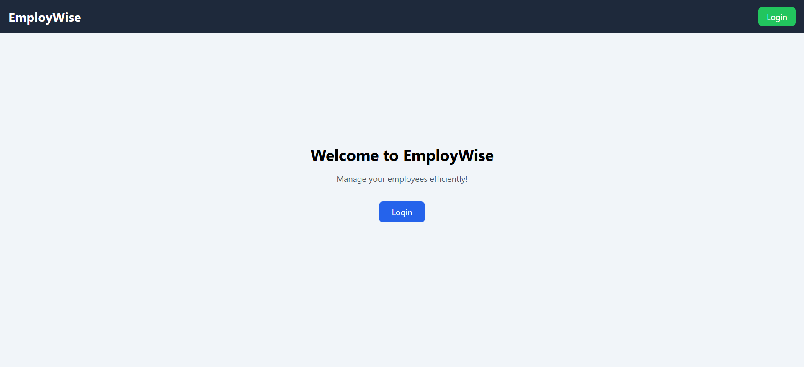
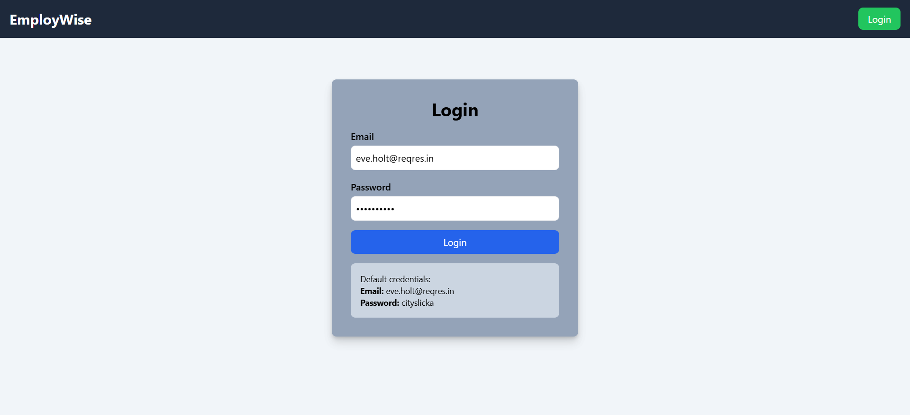
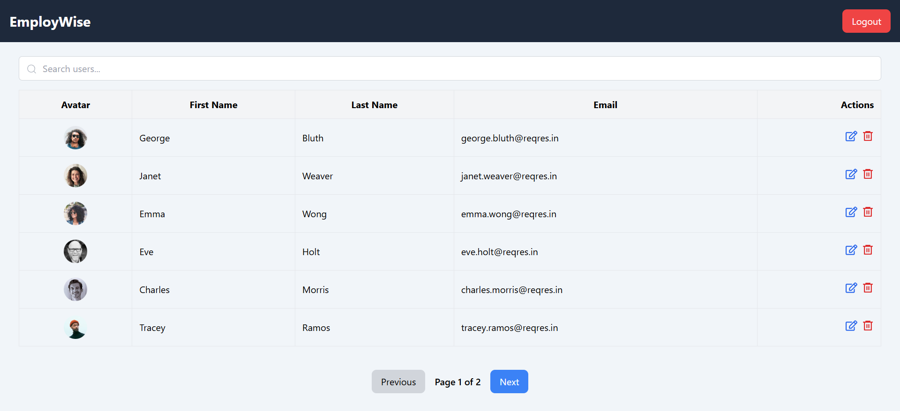

# EmployWise

EmployWise is a simple employee management system built using React, React Router DOM, and Tailwind CSS. It allows users to log in, view users, and manage employees efficiently.

## Features

- **User Authentication**: Login with predefined credentials.
- **User Management**: View a list of users fetched from an API.
- **Pagination**: Navigate through users using pagination controls.
- **Logout Functionality**: Securely log out and return to the login page.
- **Protected Routes**: Restrict access to the user management page based on authentication status.

## Technologies Used

- **React**: Frontend framework
- **React Router DOM**: Client-side routing
- **Tailwind CSS**: Styling framework

## Installation & Running Locally

Follow these steps to run the project on your local machine:

### 1. Clone the Repository

```sh
git clone https://github.com/amankashyap004/assignment-employ-wise.git
cd assignment-employ-wise
```

### 2. Install Dependencies

```sh
npm install
```

### 3. Start the Development Server

```sh
npm run dev
```

The app should now be running at:

```
http://localhost:5173  (Vite default port)
```

## Screenshots

### Home Page



### Login



### Users



## Live Demo

[Live Project](https://assignment-employ-wise.vercel.app/)

## GitHub Repository

[GitHub Repo](https://github.com/amankashyap004/assignment-employ-wise.git)

## Default Login Credentials

```
Email: eve.holt@reqres.in
Password: cityslicka
```

## Folder Structure

```
/assignment-employ-wise
 ├── /src
 │   ├── /components
 │   │   ├── /common
 │   │   │   ├── Header.tsx
 │   │   ├── DeleteConfirmationDialog.tsx
 │   │   ├── EditUserDialog.tsx
 │   │   ├── UsersList.tsx
 │   ├── /pages
 │   │   ├── Home.tsx
 │   │   ├── Login.tsx
 │   │   ├── UsersPage.tsx
 │   ├── App.css
 │   ├── App.tsx
 │   ├── index.css
 │   ├── main.tsx
 ├── package.json
 ├── tailwind.config.js
 ├── README.md
```

## License

This project is open-source and available under the MIT License.
